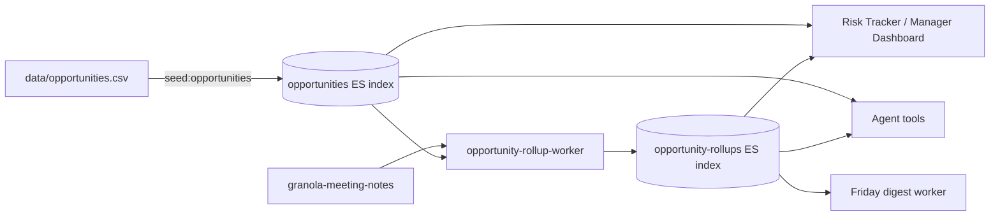

# Granola + Elastic Meeting Intelligence Pipeline

**Stop taking notes. Start winning deals and growing accounts.**

This system turns every customer meeting into structured, searchable intelligence. Team members capture meetings in Granola, review and enrich the AI-generated notes in a web UI, and push everything into Elastic Serverless with a single click. From there, an AI agent answers any question about any account in seconds, covering deal status, technical requirements, competitive landscape, open commitments, at-risk signals, and much more.

---

## The Problem We Are Solving

Pre-sales and post-sales teams are information-rich and time-poor. Every customer conversation generates valuable intelligence: the customer's current stack, the pain points they articulated, who the decision maker is, what we promised them, and what the next steps are. That intelligence ends up scattered across individual note-taking apps, memory, and email threads.

The result is that everyone on the team pays a hidden tax on every interaction:

- Account Executives spend time before calls re-reading old notes instead of preparing strategy.
- Solutions Architects take notes during meetings instead of guiding the technical conversation.
- Customer Architects onboard to accounts without a clear picture of what was promised in pre-sales.
- Leaders ask for status updates in meetings that could be answered in a 30-second search.
- Deals fall through and expansions stall because a commitment was forgotten or a follow-up slipped.

---

## The Solution: Focus on the Room

With this system in place, the dynamic changes completely.

**In the meeting,** Granola captures and transcribes everything. The SA or AE focuses on listening, asking the right questions, and guiding the conversation rather than writing bullet points.

**After the meeting,** the AI-generated Granola summary comes pre-populated into the pipeline UI. The team member reviews, enriches the note with account, tags, and action items, and ingests it. The whole process takes about two minutes.

**Before the next meeting,** one question to the Account Intelligence Agent is all it takes. Ask something like "Tell me the latest with Meridian Systems" and receive a full briefing in under ten seconds, covering the last meeting summary, open action items, competitive landscape, technical environment, stakeholder map, commitments we made, sentiment trend, and next steps.

---

## What It Does

### For the Account Executive

The Account Intelligence Agent helps AEs walk into every call prepared and walk out with every commitment captured.

- **Call prep in ten seconds.** Ask the agent for a briefing before any customer call and get the deal stage, stakeholder map (who the champion is, who is blocking), budget and timeline signals, competitive threats, and open action items, all drawn from actual meeting notes rather than CRM fields that may not have been updated in weeks.
- **Never miss a commitment.** The system tracks everything the team promised the customer. The agent surfaces overdue items before they become relationship problems.
- **Competitive awareness.** See instantly which vendors an account is evaluating, which differentiators resonated, and which objections were raised.
- **Deal velocity signals.** Momentum score, sentiment trend, and time since last meeting give the AE a clear view of which accounts need attention before the manager asks.

### For the Solutions Architect

The SA's job is to help prospects understand, technically, why Elastic is the right choice. This system makes that job easier by handling everything administrative so the SA can focus on the conversation.

- **Stay in the room.** Granola handles note-taking so the SA can focus on the whiteboard conversation, the technical questions, and guiding architecture decisions rather than capturing bullet points.
- **Technical continuity across meetings.** The full technical environment from every meeting, including current stack, pain points, requirements, constraints, and scale considerations, is stored and searchable. The SA can pick up any account at any point and immediately know what has been discussed technically.
- **POC and demo readiness.** Demo and POC requests are captured and searchable so the SA never loses track of what a customer asked to see or evaluate.
- **Salesforce 1-2-3 update in seconds.** Ask the agent "Give me the 1-2-3 for Meridian Systems" and receive a concise, copy-paste-ready Salesforce update with two to three sentences per section covering what the team did this week, what is planned next, and whether the tech win is secured. The output is ready to paste directly into Salesforce with no editing needed.
- **Tech Status (RYG) and Path to Tech Win on every opportunity.** The Enrich Panel surfaces a Tech Win section on every meeting note: Red/Yellow/Green status with a short reason, the current Path to Tech Win, the next milestone, what changed since last week, and any help needed. Those signals roll up into the Risk Tracker and the Friday digest automatically.
- **Friday auto-digest delivered to your Inbox.** Every Friday afternoon the digest worker drops a personal markdown summary into the in-app Inbox: this week at a glance, top of mind, reds and escalations, what changed, hygiene gaps, and a draft 1-2-3 ready to paste for each red or commit-stage opportunity. The same markdown lands in the shared Drive folder for searchable archive.

### For the Customer Architect

The CA's job is to help customers succeed and grow with Elastic after the deal closes. This system provides the continuity bridge between what was sold and what needs to be delivered.

- **Onboard to any account with full context.** The CA has complete visibility into every pre-sales conversation, every commitment made, and every technical decision that shaped the deal. There are no surprises and no moments of renegotiation.
- **Track what was promised.** Every commitment from pre-sales is searchable and linked to the meeting where it was made. The CA can hold the team accountable and ensure the customer gets what they were promised.
- **Identify expansion opportunities.** As new use cases and pain points surface in post-sales conversations, the agent surfaces patterns across the account's history and flags areas where Elastic can grow its footprint.
- **Technical health and adoption tracking.** The CA can query the agent for the full history of technical requirements, architectural decisions, and open questions to stay aligned with where the customer is in their journey.

### For Leadership

Leaders need account health signals without sitting in every meeting. The agent gives them that visibility on demand.

- **Pipeline visibility without additional meetings.** Ask the agent for a pipeline overview and get meeting count, sentiment trend, momentum score, and at-risk flags across all accounts in a single response.
- **At-risk early warning.** The system automatically flags accounts with negative sentiment trends or no customer contact in over 30 days so leadership can get ahead of problems before they become escalations.
- **Account health at a glance.** Rollup metrics per account are computed automatically from ingested notes and give leadership a real-time view of engagement quality rather than relying solely on CRM stage data.
- **Cross-account patterns.** The agent can identify which objections are showing up across multiple accounts, which competitors keep appearing, and which technical requirements are driving deals or stalling them.
- **Risk Tracker page that mirrors Kevin's spreadsheet.** Every opportunity with its account, ACV, close quarter, forecast category, RYG, reason, Path to Tech Win, next milestone, and what changed — filterable by SE, manager, forecast category, and tech status. One-click "Re-generate from notes" per row plus bulk CSV export so the manager can paste straight into the spreadsheet leadership already reviews.
- **Manager Dashboard for Ed and Miguel.** Five panels in one view: Tier-1 accounts at-a-glance, every red across the team sorted by ACV, top 10 opportunities by ACV with RYG, hygiene leaderboard (which SEs haven't updated which opps in 7+ days), and the exec escalation queue (high-severity opportunity-at-risk alerts).
- **Severity-aware alerts.** Opportunity-at-risk alerts fire as `high` when the opportunity is red AND (forecast category is commit OR ACV is at or above 1M). Everything else is `medium`. Ed sees the high-severity escalations at the top of his Inbox without filtering.

---

## How It Works

```
Customer Meeting
      |
      v
 Granola (AI transcription + structured summary)
      |
      v
 Pipeline UI (review, enrich, tag - about 2 minutes)
      |
      |---> Elastic Serverless
      |         - granola-meeting-notes (full structured data + Jina embeddings)
      |         - action-items (denormalized for fast querying)
      |         - account-rollups (nightly aggregations per account)
      |         - agent-alerts (overdue items, stale accounts, at-risk signals)
      |
      ---> Google Drive (markdown files, shared with team, readable by Claude Desktop)

                        v
           Account Intelligence Agent (Kibana Agent Builder)
                        |
                 Answers questions like:
                 - "Tell me the latest with Meridian Systems"
                 - "What did we promise Stratum Networks last month?"
                 - "Which accounts are at risk right now?"
                 - "Build me a call prep brief for my 2pm"
                 - "Give me my 1-2-3 for this week"
```

### The Agent

The **Account Intelligence Agent** lives in Kibana's Agent Builder. It understands the full data model, including which indices hold which data, which fields are nested, and which metrics are pre-computed in rollups. It uses 13 ES|QL tools to query structured data quickly and four built-in platform tools for semantic and natural language search across full transcripts.

The agent operates in four distinct personas depending on who is asking:

| Persona | Focus |
|---|---|
| **AE** | Deal stage, stakeholders, competitive intel, budget and timeline signals, next steps |
| **SA** | Technical environment, POC requests, architecture decisions, 1-2-3 Salesforce updates |
| **CA** | Pre-sales commitments, expansion opportunities, post-sales technical continuity |
| **Leader** | Account rollups, sentiment trends, at-risk flags, pipeline coverage |

The agent cites every source note by meeting title, date, and author so you can always trace back to the original transcript.

---

## Data Sources & Constraints

The pipeline blends two kinds of data: **conversational truth** (everything our team learns in meetings) and **opportunity spine truth** (the deal-level facts that live in Salesforce and Clari).

### Conversational truth — owned by us

`granola-meeting-notes`, `account-rollups`, `action-items`, `agent-alerts`, and `account-pursuit-team` are all written by the team via the pipeline UI and the workers. We control the schema and the freshness end-to-end.

### Opportunity spine truth — Salesforce + Clari (currently unavailable)

The Risk Tracker, Manager Dashboard, and Friday digest need opportunity-level fields that the team does not own: ACV, close quarter, forecast category, sales stage, owner SE, owner AE, manager, and account tier. Those live in Salesforce and Clari. **We do not have API access to either today.**

To unblock the MVP, the opportunity spine is sourced from a CSV checked into the repo and loaded into a dedicated Elastic index:



Rules:

1. **All UI and agent code reads the `opportunities` index — never the CSV directly.** The CSV is an input to the seed script, not a runtime data source.
2. **The seed script is idempotent.** `npm run seed:opportunities` upserts every row keyed on `opp_id`, so re-running is safe.
3. **The CSV is not a system of record.** Keep it in sync with what Ed reads in Clari. If the customer's true ACV changes, update the CSV and re-seed.
4. **When Salesforce or Clari API access lands**, replace the CSV loader with a poller that writes the same `opportunities` index documents. UI, agent tools, dashboards, and digests stay unchanged. See [docs/data-sources.md](docs/data-sources.md) for the full ADR and cutover plan.

The seed file is [data/opportunities.csv](data/opportunities.csv) and the loader is [scripts/seed-opportunities.ts](scripts/seed-opportunities.ts).

---

## Quick Start

### 1. Prerequisites

- Node.js 18 or higher
- An Elastic Cloud account with an Elasticsearch Serverless project
- A Granola Business or Enterprise account for API access
- Google Drive for Desktop (optional, for shared markdown files)

### 2. Configure

```bash
git clone https://github.com/leungsteve/AgenticMeetingNotes.git
cd AgenticMeetingNotes
npm install
cp .env.example .env
# Edit .env and add your ELASTIC_CLOUD_ID and ELASTIC_API_KEY
```

### 3. Initialize

```bash
# Create all Elastic indices and update the ingest pipeline
npm run setup:elastic

# Seed lookup values (accounts, tags, meeting types)
npm run seed:lookups

# Create the Account Intelligence Agent in Kibana with all ES|QL tools
npm run setup:kibana-agent
```

### 4. Run

```bash
npm run dev
# Frontend: http://localhost:5173
# Backend API: http://localhost:3001
```

---

## Demo Mode (synthetic data, fictitious accounts)

Want to see the Risk Tracker, Manager Dashboard, and Friday digest in action without ingesting real customer data? Run the synthetic-data pipeline:

```bash
npm run demo:all
```

That single command runs `setup:elastic` → `seed:lookups` → `seed:opportunities` → `seed:demo-notes` → `run:rollups` → `run:alerts` → `run:digest`. About 60 seconds end-to-end. When it finishes you have:

- 12 fictitious opportunities across 8 accounts (Aurora Health Systems, Helix Robotics, Lattice Insurance, Polaris Energy, Meridian Systems, Stratum Networks, Redwood Logistics, Nimbus Cloud) — all defined in `data/opportunities.csv`.
- ~22 synthetic Granola notes with realistic summary, technical environment, action items, commitments, sentiment, competitive landscape, and the new Tech Win fields (RYG, Path to Tech Win, Next Milestone, What Changed, Help Needed). Notes are tuned so:
  - **Aurora Security** (commit, $1.85M) → red, exec-escalation
  - **Helix Platform** (commit, $2.4M) → red, biggest deal slipping
  - **Polaris SIEM** (commit, $950K) → red, POC blockers
  - **Meridian Serverless** (commit, $1.1M) → yellow, pricing gap
  - **Aurora Observability** / **Helix Migration** → yellow upside
  - **Lattice / Stratum / Polaris AI / Nimbus** → green
  - **Redwood Logistics** → stale (no meeting in 60 days) so the hygiene panel lights up
- Per-opportunity rollups, severity-aware alerts, and a Friday digest in the Inbox + Drive.

To re-seed from a clean slate (deletes synthetic data only; preserves index mappings and the Kibana agent):

```bash
npm run demo:reset && npm run demo:all
```

To customize the demo accounts to your taste, edit `data/opportunities.csv` and the matching arrays at the top of `scripts/seed-lookups.ts` and `scripts/seed-demo-notes.ts`. **Never commit real customer names** — the seed data is fictitious by design and `src/server/routes/opportunities.ts` enforces no hardcoded account names.

---

## The Workflow

### Team Member (AE, SA, or CA)

1. **Hold the meeting.** Granola captures and transcribes automatically in the background.
2. **Open the pipeline UI.** Navigate to My Notes and select the From Granola tab.
3. **Review the AI summary.** Fix any misattributions and add any missing context.
4. **Enrich the note.** Set the Account, Opportunity, Meeting Type, Tags, and Action Items.
5. **Click Ingest.** The note is indexed into Elastic and a markdown copy is written to shared Drive.
6. **Done.** The whole process takes two to three minutes.

### SA Weekly Salesforce Update (1-2-3)

For each account or opportunity, SAs need to update Salesforce with three things. Ask the agent:
> "Give me the 1-2-3 for Meridian Systems"

The agent calls three tools in parallel and returns a concise, copy-paste-ready update. Each section is two to three sentences. Here is an example:

```
1. WHAT DID WE DO THIS WEEK
We held a technical discovery call with the Meridian Systems infrastructure team
to review the serverless cost model and three consolidation scenarios. The customer
confirmed their architecture and agreed to move forward with a refined multi-tenant
estimate. A follow-up is scheduled for next week with updated regional pricing.

2. WHAT ARE WE PLANNING TO DO NEXT WEEK
Brent will deliver a revised cost estimate covering three consolidation scenarios
with regional breakdowns and three search-power tiers by April 28. The team will
also provide the serverless cost model documentation requested during the call.

3. DO WE HAVE THE TECH WIN?
Not yet. The customer is technically engaged and the architecture is agreed, but
the price gap relative to their current spend needs to close before they commit.
The follow-up with revised numbers is the critical next step.
```

### Before a Customer Call

Ask the Account Intelligence Agent in Kibana:
> "Give me a call prep brief for Meridian Systems. I have a meeting in an hour."

The agent returns in seconds with the following:
- Last three meeting summaries with key takeaways
- Open action items and anything that is overdue
- Technical environment snapshot (current stack, pain points, requirements)
- Stakeholder map (decision makers, champions, blockers)
- Competitive landscape and any vendors being evaluated
- Commitments the team made and when they were made
- Sentiment trend and momentum score

### Leadership Review

Ask the agent questions like these:
> "Which accounts are at risk right now?"
> "Compare Meridian Systems and Stratum Networks in terms of momentum."
> "What changed for Redwood Logistics in the last 30 days?"

---

## Elastic Indices

| Index | Purpose |
|---|---|
| `granola-meeting-notes` | Full structured meeting notes with Jina embeddings |
| `granola-sync-state` | Per-user sync state and API key storage |
| `granola-lookups` | Reference data including accounts, opportunities, tags, and meeting types |
| `account-pursuit-team` | Pursuit team roster per account (AE, SA, CA) |
| `account-rollups` | Nightly per-account aggregations covering sentiment, momentum, and competitor set |
| `action-items` | Denormalized action items for fast agent queries |
| `agent-actions` | Audit log of every agent tool call |
| `agent-alerts` | Alerts for overdue items, stale accounts, and at-risk signals |
| `agent-feedback` | Thumbs ratings on agent responses |
| `integrations-slack-users` | Slack user to email mapping (Phase 3) |
| `opportunities` | Opportunity spine seeded from `data/opportunities.csv` (stand-in for Salesforce + Clari) |
| `opportunity-rollups` | Per-opportunity rollups: Tech Status RYG, Path to Tech Win, latest milestone, what changed, escalation flag |

The ingest pipeline uses `.jina-embeddings-v3`, which is Elastic-managed and requires no external API key, for semantic embeddings on every summary and transcript. The agent's hybrid search uses `.jina-reranker-v2-base-multilingual` for reranking.

---

## Granola Setup

Each team member needs Granola configured with the structured meeting template. Go to Granola Settings, open Templates, and create the "Account Meeting" template from the spec in `project_brief.md`. The template structures Granola's AI output so the pipeline can reliably extract attendees, action items, technical details, competitive intel, and more.

Without structure, the AI summary is a narrative. With the template, it is a database row where every field is predictable and every question the agent might ask is answered from the right place.

---

## Architecture

```
+----------------------------------------------------------+
|                   WEB UI (React + Tailwind)               |
|  My Notes | Team View | Accounts | Inbox | Chat | SFDC   |
+---------------------+------------------------------------+
                      | REST API
              +-------+--------+
              | Express Backend |
              | Port 3001       |
              +--+----------+--+
                 |          |
    +------------+          +--------------+
    v                                      v
Elastic Serverless                   Google Drive
  - 10 indices                        (shared markdown)
  - Jina embeddings
  - Nightly workers
  - Agent alerts

    v
Kibana Agent Builder
  Account Intelligence Agent
  13 ES|QL tools + 4 built-in tools
  AE / SA / CA / Leader personas
```

---

## Ops

```bash
npm run setup:elastic        # Create indices and update the pipeline (idempotent)
npm run setup:kibana-agent   # Create or update the Kibana agent and all ES|QL tools (idempotent)
npm run seed:lookups         # Seed reference data (fictitious accounts/opportunities)
npm run seed:opportunities   # Upsert opportunity spine rows from data/opportunities.csv (Salesforce/Clari stand-in)
npm run seed:demo-notes      # Generate fictitious Granola notes per opportunity (synthetic demo)
npm run run:rollups          # Trigger account + opportunity rollup computation
npm run run:alerts           # Trigger the alerts worker (overdue, stale, opportunity-at-risk)
npm run run:digest           # Generate Friday SE + Manager digests (in-app Inbox alert + Drive markdown)
npm run run:eval             # Run the eval harness against gold Q&A sets
npm run demo:all             # Full demo seed end-to-end (setup + seeds + rollups + alerts + digest)
npm run demo:reset           # Wipe synthetic demo data (keeps index mappings and the Kibana agent)
```

---

## Roadmap

| Phase | Status | Description |
|---|---|---|
| 0 | Done | Elastic indices, Jina EIS inference, and ingest pipeline |
| 1 | Done | Kibana Agent Builder agent, 13 ES|QL tools, UI pages, and background workers |
| 2 | In Progress | The `/chat` page with SSE proxy to the Agent Builder REST API |
| 3 | In Progress | Slack slash command (`/intelligence`) |
| 4 | Done (MVP) | Opportunity spine (CSV → ES), Risk Tracker page, Manager Dashboard, Friday digest, severity-aware alerts |
| TBD | Planned | Live Salesforce + Clari opportunity sync replacing the CSV seeder (UI/agent unchanged) |
| TBD | Planned | POC Tracker page and POC Requirements builder |
| TBD | Planned | LTR (Learning to Rank) fine-tuning on agent feedback |

---

## Team Roles

| Role | How They Use It |
|---|---|
| **AE** | Call prep briefs, deal stage tracking, competitive intel, and commitment follow-up |
| **SA** | In-meeting focus, technical environment continuity, POC tracking, weekly 1-2-3 updates, Tech Win RYG enrichment |
| **CA** | Account onboarding with full pre-sales context, commitment visibility, and expansion opportunity identification |
| **SA Manager (Ed)** | Manager Dashboard, Risk Tracker, exec escalation queue, hygiene leaderboard, aggregated Friday digest |
| **Director (Miguel) / Kevin** | Top-10 by ACV with RYG, Path to Tech Win per opportunity, all reds across the team |
| **Leader (back-compat)** | Pipeline health, at-risk flags, cross-account patterns, and account health on demand |

---

## License

[TBD]
