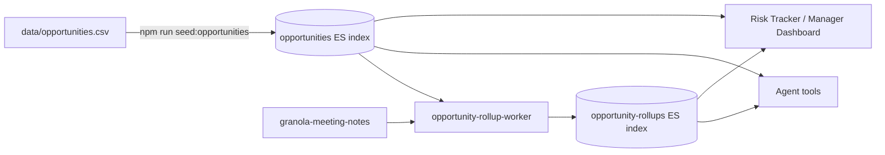

# Data Sources & Constraints

## Status

Adopted, 2026-04-25. Applies to the MVP (Risk Tracker, Manager Dashboard, Friday digest). Revisit when Salesforce or Clari API access is granted.

## Context

Ed Salazar's "operating system" for the SA team needs an **opportunity-level spine** to drive the Risk Tracker, Manager Dashboard, and weekly digests:

- Account, opportunity name, ACV, close quarter, forecast category, sales stage
- Owner SE, owner AE, manager
- Account tier (1 / 2 / 3)

In production those fields live in Salesforce and Clari. **Neither exposes a working API to this app today** — we asked, and the org's Salesforce connector for Claude is also not approved. That cannot block the MVP.

Meeting-derived intelligence (Tech Status RYG, Path to Tech Win, What Changed, Help Needed, Next Milestone, blockers, sentiment, action items) already lives in `granola-meeting-notes` and rolls up into `account-rollups`. We need to **join** that with the spine, not duplicate Salesforce.

## Decision

The opportunity spine is sourced from a CSV checked into the repo and loaded into a dedicated Elastic index. All UI and agent code reads from the index, never from the CSV directly.

### Concretely

- File: [data/opportunities.csv](../data/opportunities.csv) is the source of truth for opportunity spine fields.
- Seed: [scripts/seed-opportunities.ts](../scripts/seed-opportunities.ts) (run via `npm run seed:opportunities`) parses the CSV and upserts each row into the `opportunities` Elastic index. Doc id is deterministic from `opp_id` so re-runs are idempotent.
- Read: server, agent tools, dashboards, and the Friday digest worker all call `ElasticService.listOpportunities` / `getOpportunity`. The CSV is never read at request time.
- Write: only the seeder writes to `opportunities`. The UI does not edit opportunity-spine fields for MVP — those reflect what is in Salesforce/Clari, which is the system of record.

### Cutover plan

When Salesforce or Clari API access lands:

1. Build a new `scripts/sync-sfdc-opportunities.ts` (or similar) that pulls from the API and upserts the same `opportunities` index documents.
2. Replace `seed:opportunities` in cron / CI with the new poller, or run both side by side during validation.
3. Delete `data/opportunities.csv` once the poller is the canonical source.

UI, agent tools, dashboards, and digests do not change. The contract is the index, not the CSV.

## Why CSV + ES (and not the alternatives)

| Option | Why we did not pick it |
|---|---|
| Pure CSV read at request time | Loses ES|QL access for the agent; requires custom in-memory filtering; doesn't index well into the existing rollup pipeline. |
| ES-only with manual seeding | No reproducible seed for new envs; no obvious diff for what changed; can't easily share spine data across teammates. |
| Inline in note enrichment | Couples spine truth to whoever happens to ingest the latest note; an opportunity with no recent meeting becomes invisible. |
| Wait for Salesforce API | Ed's May-1 demo to Miguel cannot wait. |

## Operational notes

- The CSV is small (one row per opportunity, ≤ a few hundred for Strat). Edit it in any spreadsheet tool, save as CSV, re-run `npm run seed:opportunities`. Seeded changes are visible in the UI within a few seconds.
- `opp_id` should match the eventual Salesforce 18-char Id when known. For MVP rows that don't have a real SFDC id yet, use a stable placeholder like `ACC-OPP-2026Q2-SEC` so the row survives re-seeds.
- Do not treat the CSV as a system of record. If you change ACV in the CSV but the customer's true ACV in Salesforce differs, the dashboard and digests will lie. Keep the CSV in sync with what Ed reads in Clari.

## Fictitious data only

Every account name in `data/opportunities.csv`, `scripts/seed-lookups.ts`, and `scripts/seed-demo-notes.ts` is fictitious. The default set — Aurora Health Systems, Helix Robotics, Lattice Insurance, Polaris Energy, Meridian Systems, Stratum Networks, Redwood Logistics, Nimbus Cloud — is hand-picked to avoid any well-known Elastic customer. To customize:

1. Edit `data/opportunities.csv` (the spine).
2. Update the matching arrays at the top of `scripts/seed-lookups.ts` (UI dropdowns) and `scripts/seed-demo-notes.ts` (synthetic Granola notes scenarios).
3. Re-run `npm run demo:reset && npm run demo:all`.

Never commit real customer names. The header comment in `src/server/routes/opportunities.ts` makes this explicit so future contributors know.

## Synthetic demo data

`scripts/seed-demo-notes.ts` generates 22+ fictitious Granola meeting notes — one to three per opportunity — with realistic summary, technical environment, action items (some overdue), commitments, sentiment, competitive landscape, demo/POC requests, and the new Tech Win fields (RYG status + reason, Path to Tech Win, Next Milestone, What Changed, Help Needed). Each note is indexed through the standard Granola pipeline so Jina embeddings are computed and the agent can answer questions about it the same way it would for a real ingest.

Scenarios are tuned to exercise every dashboard panel and alert path:

| Opportunity | ACV | Forecast | RYG | What it demonstrates |
|---|---|---|---|---|
| `AURORA-SEC-2026Q2` | $1.85M | commit | red | Exec escalation (high severity); Help Needed wired up |
| `HELIX-PLAT-2026Q1` | $2.4M | commit | red | Biggest red; multiple notes; SOW redline drama |
| `POLARIS-SEC-2026Q2` | $950K | commit | red | POC at risk; competitive landscape with skeptical buyer |
| `MERIDIAN-SVL-2026Q2` | $1.1M | commit | yellow | Tier-1 yellow; pricing gap |
| `AURORA-OBS-2026Q3` / `HELIX-MIG-2026Q3` | $420K / $680K | upside | yellow | Mid-tier yellows |
| `LATTICE-OBS-2026Q2`, `STRATUM-OBS-2026Q3`, `POLARIS-AISEARCH-2026Q3`, `NIMBUS-AISEARCH-2026Q2`, `LATTICE-SEARCH-2026Q4` | varies | mixed | green | Healthy momentum |
| `REDWOOD-LOG-2026Q4` | $165K | pipeline | yellow | Stale (no meeting in 60 days) — hygiene leaderboard |

Re-running the seed is idempotent: note IDs are deterministic per opportunity + meeting type + days-ago, so running `npm run demo:all` twice does not create duplicate notes.
